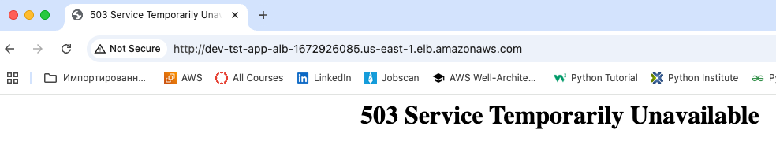
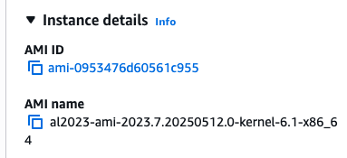
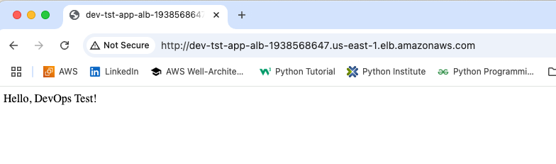
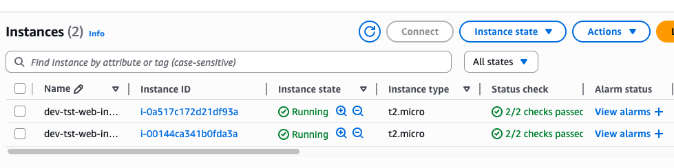
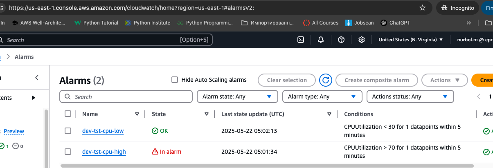
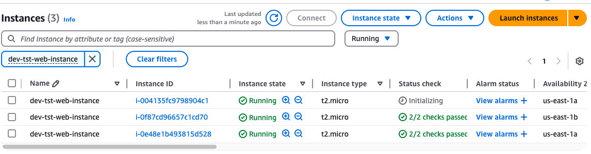
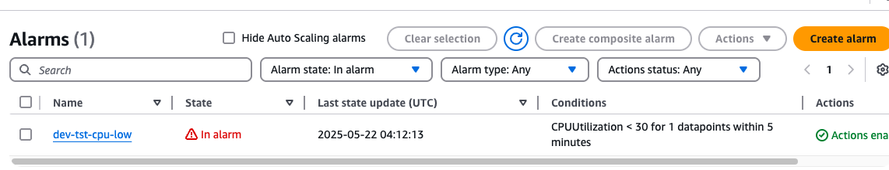
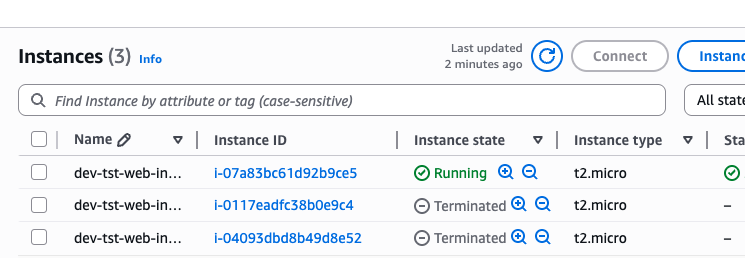
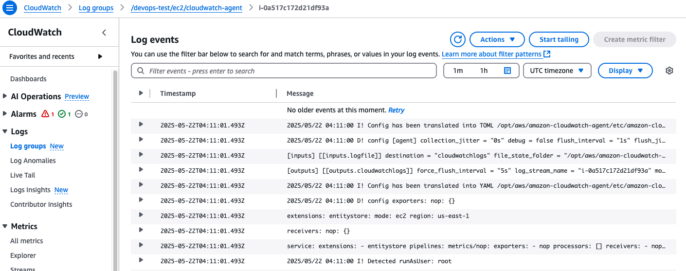
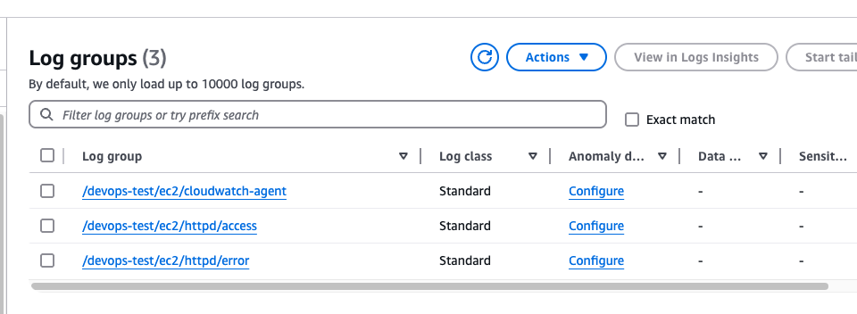

# Scalable Web App Deployment with AWS & IaC

## Project Summary

This project is a solution to the **DevOps Proficiency Test**, demonstrating the ability to provision and manage scalable AWS infrastructure using **Terraform (IaC)**. It provisions a secure, modular, and autoscaling web application stack on AWS.

## Objective

### Deploy a simple, scalable web application using the following AWS services:

- **EC2** instances (Amazon Linux 2023)
- **Application Load Balancer (ALB)**
- **Auto Scaling Group (ASG)**
- **Target Groups**

## Expectations for a Senior DevOps Engineer

- ✅ Mandatory use of **Infrastructure as Code (IaC)** (no manual AWS Console work)
- ✅ Use **Amazon Linux 2023** (not Amazon Linux 2)
- ✅ Follow **AWS best practices** for scalability, security, and availability
- ✅ **Modular**, reusable Terraform code
- ✅ **Well-documented steps** for clarity and collaboration
- ✅ Simulate real-world **autoscaling behavior**

---

## Project Structure

```sh
├── README.md
├── terraform
│   ├── main.tf
│   ├── dev.tfvars             # Customizable variables
│   ├── init.tf
│   ├── outputs.tf
│   ├── variables.tf
│   ├── iam_backend.tf         # Uncomment if use remote tfstate
│   ├── modules
│   │   ├── alarms             # CloudWatch Alarms
│   │   │   ├── main.tf
│   │   │   ├── outputs.tf
│   │   │   └── variables.tf 
│   │   ├── alb                # Load Balancer
│   │   │   ├── main.tf
│   │   │   ├── outputs.tf
│   │   │   └── variables.tf
│   │   ├── asg                # Auto-scaling Group
│   │   │   ├── main.tf
│   │   │   ├── outputs.tf
│   │   │   └── variables.tf
│   │   ├── iam                # AIM for CloudWatch
│   │   │   ├── main.tf
│   │   │   ├── outputs.tf
│   │   │   └── variables.tf
│   │   ├── launch_template    # launch-template
│   │   │   ├── main.tf
│   │   │   ├── outputs.tf
│   │   │   ├── userdata.sh
│   │   │   └── variables.tf
│   │   ├── sg                 # Security groups
│   │   │   ├── main.tf
│   │   │   ├── outputs.tf
│   │   │   └── variables.tf
│   │   └── vpc                # Network
│   │       ├── main.tf
│   │       ├── outputs.tf
│   │       └── variables.tf
└── terraform-backend          # Uncomment if use S3 and DynamoDB for remote tfstate and lock
    ├── dev.tfvars
    ├── outputs.tf
    ├── provider.tf
    ├── s3-dynamodb.tf
    └── variables.tf
```

### The project is organized to enable modular, reusable, and scalable infrastructure code using Terraform.

The main Terraform code resides in the 'terraform' folder, which contains all core configuration and modules.

The project uses independent modules 'terraform/modules' for each key component: VPC, Security Groups (SG), Application Load Balancer (ALB), Auto Scaling Group (ASG), IAM roles, launch templates, and CloudWatch alarms. This modular design allows for easy maintenance and reuse.

Environment-specific variables are stored in 'dev.tfvars' to customize deployments without changing the core code, enabling easy switching between environments.

The 'terraform-backend' folder contains configuration for remote Terraform state management using AWS S3 and DynamoDB. This setup helps multiple engineers collaborate safely by preventing concurrent state changes. It was not used due lack of permissions, however is a working code.

# Deployment & Cleanup Instructions

## Set Environment Variables
Before running any Terraform commands, export the required variables used in the code:

```sh
export TF_VAR_aws_account_id="711685268649"
export TF_VAR_region="us-east-1"
export TF_VAR_iam_user_name="nurbol.m"
```
or use variables in the 'dev.tfvars':

```sh
# Global variables:
aws_account_id = "711685268649"
region         = "us-east-1"
iam_user_name  = "nurbol.m"
```
## Deploy Infrastructure
Run the following Terraform commands from the root of your 'terraform/' directory:

```sh
terraform init
terraform plan -var-file='dev.tfvars'
terraform apply -var-file='dev.tfvars' -auto-approve
```

## Simulate Load to Test Auto Scaling
To verify that the Auto Scaling Group (ASG) scales out under high CPU load, simulate CPU usage on an EC2 instance using the stress tool.

### Uncomment and save the following command in the 'modules/launch_template/userdata.sh' file
It will install 'stress' tool, delays stress start to allow instance to stabilize and runs 'stress' in background for 600 seconds:

```sh
sudo yum install -y stress \
  && sleep 180 \
  && nohup stress --cpu 1 --io 1 --vm 1 --vm-bytes 64M --timeout 600 &
```

## Destroy Infrastructure
To clean up and remove all created AWS resources:

```sh
terraform destroy -var-file='dev.tfvars' -auto-approve
```

## ✅ Tasks Overview

| Status | Task Description |
|--------|------------------|
| ✅ Done | **Application Load Balancer (ALB)** - Create Security Group to allow HTTP (port 80) |
| ✅ Done | Create an Application Load Balancer |
| ✅ Done | Configure the ALB listener to accept HTTP traffic on port 80 |
| ✅ Done | Verify the ALB DNS resolves and returns 503 (before targets registered) |

| ✅ Done | **Target Group** - Create a Target Group for HTTP on port 80 |
| ✅ Done | **Integrate ALB and Target Group** - Connect ALB listener to Target Group |
| ✅ Done | **Auto Scaling Group (ASG)** - Create a Launch Template using Amazon Linux 2023 |

| ✅ Done | Use User Data script to install Apache/Nginx and create "Hello, DevOps Test!" page |

| ✅ Done | Deploy ASG with desired capacity of 2 |

| ✅ Done | Associate ASG with the Target Group |
| ✅ Done | Verify instances register to TG and serve content via ALB DNS |
| ✅ Done | Confirm ALB DNS serves traffic from both instances |
```sh
aws elbv2 describe-target-health \
  --target-group-arn $TG_ARN \
  --query 'TargetHealthDescriptions[*].[Target.Id,TargetHealth.State]' \
  --output table
zsh: command not found: #
------------------------------------
|       DescribeTargetHealth       |
+----------------------+-----------+
|  i-057f67baa84faa107 |  healthy  |
|  i-049a9b1fc749aaf13 |  healthy  |
+----------------------+-----------+
```
| ✅ Done | **Auto Scaling Policy** - Set scale-out policy for CPU > 70% for 5 mins |

| ✅ Done | Simulate load using `stress` utility |


| ✅ Done | Confirm new instance is added during load |

| ✅ Done | Observe scale-in event once load is removed |




## ⭐ Bonus Points

| Status | Enhancement Description |
|--------|--------------------------|
| ✅ Done | Use Terraform modules or CloudFormation nested stacks |
| ✅ Done | Integrate CloudWatch Logs |




| ✅ Done | Use `terraform output` to display key info (like ALB DNS) |
| ✅ Done | Use variables for environment reuse |# epcvip
